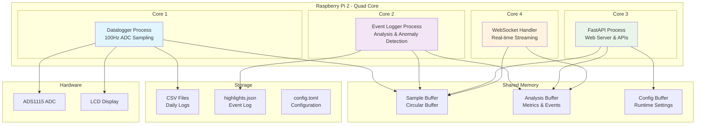

# Design Document

## Overview

This design transforms the current single-process FastAPI application into a multiprocessing architecture optimized for the Raspberry Pi 2's quad-core CPU. The system will be decomposed into four specialized processes that communicate via shared memory, ensuring high-frequency sampling continues uninterrupted while maintaining all existing functionality.

The architecture prioritizes real-time performance for the datalogger while preserving the existing API contracts, WebSocket streaming, hardware integration, and event detection capabilities.

## Architecture

### Process Architecture



### Process Responsibilities

**Datalogger Process (Core 1)**
- High-frequency ADC sampling at 100Hz
- Shared memory buffer management
- CSV file writing with batch optimization
- Hardware ADC configuration and error handling
- Display manager integration for LCD updates

**Event Logger Process (Core 2)**
- Real-time stream analysis (RMS, frequency, sags/swells)
- Anomaly detection and event classification
- Highlights file management
- Analysis metrics computation and caching

**FastAPI Process (Core 3)**
- HTTP API endpoints (/api/recent, /api/range, /api/highlights, /api/config)
- Static file serving and template rendering
- Configuration management and process coordination
- Health monitoring and process supervision

**WebSocket Handler (Core 4)**
- Real-time data broadcasting to connected clients
- Connection management and client lifecycle
- Message queuing and throttling (5Hz analysis updates)
- Demo mode WebSocket simulation

## Components and Interfaces

### ADC Adapter Pattern

To support future migration from ADS1115 to AD7606, the system uses an adapter pattern for ADC hardware abstraction:

```python
class ADCAdapter(ABC):
    @abstractmethod
    def initialize(self, config: Dict) -> bool:
        """Initialize the ADC hardware with given configuration."""
        pass
    
    @abstractmethod
    def read_sample(self) -> float:
        """Read a single voltage sample from the ADC."""
        pass
    
    @abstractmethod
    def set_sample_rate(self, rate_hz: int) -> bool:
        """Configure the ADC sample rate."""
        pass
    
    @abstractmethod
    def cleanup(self) -> None:
        """Clean up ADC resources."""
        pass

class ADS1115Adapter(ADCAdapter):
    """Current ADS1115 implementation."""
    def initialize(self, config: Dict) -> bool:
        # Existing ADS1115 initialization logic
        
class AD7606Adapter(ADCAdapter):
    """Future AD7606 implementation."""
    def initialize(self, config: Dict) -> bool:
        # Future AD7606 initialization logic

class MockADCAdapter(ADCAdapter):
    """Simulation adapter for testing."""
    def initialize(self, config: Dict) -> bool:
        # Mock implementation for demo mode
```

The datalogger process uses a factory pattern to instantiate the appropriate adapter based on configuration:

```python
def create_adc_adapter(adc_type: str, config: Dict) -> ADCAdapter:
    adapters = {
        'ads1115': ADS1115Adapter,
        'ad7606': AD7606Adapter,
        'mock': MockADCAdapter
    }
    return adapters[adc_type](config)
```

### Shared Memory Architecture

The system uses Python's `multiprocessing.shared_memory` module to create memory-mapped data structures accessible across all processes.

#### Sample Buffer (Circular Buffer)
```python
class SharedSampleBuffer:
    def __init__(self, size: int = 6000):  # 60 seconds at 100Hz
        self.size = size
        self.buffer = SharedMemory(create=True, size=size * 16)  # 8 bytes ts + 8 bytes val
        self.head = Value('i', 0)  # Write position
        self.count = Value('i', 0)  # Current sample count
        self.lock = Lock()  # For atomic operations
    
    def write_sample(self, timestamp: float, value: float) -> None:
        # Lock-free circular buffer write
        
    def read_recent(self, seconds: float) -> List[Tuple[float, float]]:
        # Lock-free read of recent samples
```

#### Analysis Buffer
```python
class SharedAnalysisBuffer:
    def __init__(self):
        self.buffer = SharedMemory(create=True, size=1024)  # JSON-serialized metrics
        self.last_update = Value('d', 0.0)  # Timestamp of last update
        self.lock = Lock()
    
    def update_metrics(self, rms: float, freq: float, events: List[Dict]) -> None:
        # Thread-safe metrics update
        
    def get_current_analysis(self) -> Dict:
        # Read current analysis metrics
```

#### Configuration Buffer
```python
class SharedConfigBuffer:
    def __init__(self):
        self.buffer = SharedMemory(create=True, size=2048)  # JSON config
        self.version = Value('i', 0)  # Config version for change detection
        self.lock = Lock()
    
    def update_config(self, config: Dict) -> None:
        # Update configuration and increment version
        
    def get_config(self) -> Tuple[Dict, int]:
        # Get config and version atomically
```

### Process Communication Protocol

#### Startup Sequence
1. **Main Process** creates shared memory segments and configuration
2. **Datalogger Process** starts, initializes ADC, begins sampling
3. **Event Logger Process** starts, begins analysis of shared buffer
4. **FastAPI Process** starts web server, registers API endpoints
5. **WebSocket Handler** starts within FastAPI's asyncio event loop

#### Shutdown Sequence
1. **Main Process** sends SIGTERM to all child processes
2. **WebSocket Handler** closes all connections gracefully
3. **FastAPI Process** stops accepting new requests
4. **Event Logger Process** flushes pending events to disk
5. **Datalogger Process** flushes remaining samples to CSV
6. **Main Process** cleans up shared memory segments

### Inter-Process Coordination

#### Process Supervision
```python
class ProcessSupervisor:
    def __init__(self):
        self.processes = {}
        self.shared_memory = {}
        self.shutdown_event = Event()
    
    def start_process(self, name: str, target: callable, args: tuple) -> Process:
        # Start and monitor child process
        
    def monitor_health(self) -> None:
        # Check process health and restart if needed
        
    def graceful_shutdown(self) -> None:
        # Coordinate shutdown sequence
```

#### Configuration Synchronization
Configuration changes propagate through the shared configuration buffer with version tracking. Each process polls for configuration changes and applies updates without restart.

## Data Models

### Shared Memory Data Structures

#### Sample Data Point
```python
@dataclass
class SamplePoint:
    timestamp: float  # Unix timestamp with microsecond precision
    value: float      # ADC voltage reading
    
    def to_bytes(self) -> bytes:
        return struct.pack('dd', self.timestamp, self.value)
    
    @classmethod
    def from_bytes(cls, data: bytes) -> 'SamplePoint':
        ts, val = struct.unpack('dd', data)
        return cls(ts, val)
```

#### Analysis Metrics
```python
@dataclass
class AnalysisMetrics:
    rms: float
    frequency: float
    sags_swells: List[Dict]
    last_updated: float
    
    def to_json(self) -> str:
        return json.dumps(asdict(self))
    
    @classmethod
    def from_json(cls, data: str) -> 'AnalysisMetrics':
        return cls(**json.loads(data))
```

#### Process Configuration
```python
@dataclass
class ProcessConfig:
    sample_hz: int
    batch_size: int
    batch_interval_ms: int
    analysis_config: Dict
    display_fps: float
    version: int
    
    def to_json(self) -> str:
        return json.dumps(asdict(self))
```

### File System Data Models

The existing CSV format and highlights.json structure remain unchanged to maintain backward compatibility:

- **CSV Format**: `timestamp,value` with daily rotation
- **Highlights Format**: JSON array of event objects with start/end timestamps
- **Configuration Format**: TOML with nested sections for different components

## Correctness Properties

*A property is a characteristic or behavior that should hold true across all valid executions of a system-essentially, a formal statement about what the system should do. Properties serve as the bridge between human-readable specifications and machine-verifiable correctness guarantees.*

Based on the prework analysis, the following properties validate the system's correctness:

### Property 1: Process Fault Isolation
*For any* running system with multiple processes, when one process crashes or encounters an error, all other processes should continue operating normally without interruption.
**Validates: Requirements 1.2, 1.3**

### Property 2: Shared Memory Performance
*For any* data operation (sample write or analysis update), the operation should complete within the specified latency bounds (1ms for samples, 10ms for WebSocket delivery).
**Validates: Requirements 2.1, 4.1**

### Property 3: Circular Buffer Behavior
*For any* shared memory buffer at capacity, writing new samples should overwrite the oldest samples while maintaining the total buffer size.
**Validates: Requirements 2.4**

### Property 4: Non-blocking Memory Access
*For any* concurrent read and write operations on shared memory, read operations should not block write operations or affect their timing consistency.
**Validates: Requirements 2.2**

### Property 5: Data Persistence Continuity
*For any* file operation (daily rotation, batch writing), sampling should continue at the expected rate without interruption or data loss.
**Validates: Requirements 3.2, 3.3**

### Property 6: WebSocket Message Format Preservation
*For any* WebSocket message sent to clients, the message should match the existing JSON structure and include all required fields.
**Validates: Requirements 4.4**

### Property 7: Analysis Metrics Broadcasting
*For any* analysis metrics update, the metrics should be included in WebSocket messages at the correct frequency (5Hz) and be accessible to all connected clients.
**Validates: Requirements 4.2**

### Property 8: Event Detection and Persistence
*For any* detected anomaly (sag, swell, frequency deviation), the system should compute appropriate metadata and persist it to the highlights file.
**Validates: Requirements 5.1, 5.2**

### Property 9: Configuration Propagation
*For any* configuration change made via API or file update, the change should propagate to the appropriate processes without requiring full system restart.
**Validates: Requirements 7.2, 7.3, 7.5, 9.5**

### Property 10: API Backward Compatibility
*For any* existing API endpoint, the response format and data source behavior should remain unchanged to maintain client compatibility.
**Validates: Requirements 9.1, 9.2, 9.3, 9.4**

### Property 11: Hardware Fallback Behavior
*For any* hardware initialization failure, the system should gracefully fall back to simulation mode without crashing.
**Validates: Requirements 6.5**

### Property 12: Process Supervision and Recovery
*For any* child process that terminates unexpectedly, the supervisor should detect the failure and attempt to restart the process.
**Validates: Requirements 8.2, 8.4**

### Property 13: Sampling Performance Consistency
*For any* system load condition, the datalogger process should maintain consistent 100Hz sampling with minimal jitter and priority over other processes.
**Validates: Requirements 10.1, 10.5**

### Property 14: Resource Usage Bounds
*For any* system state during normal operation, total memory usage should not exceed 50% of available RAM and CPU load should be distributed across available cores.
**Validates: Requirements 10.2, 10.3**

### Property 15: File Format Preservation
*For any* generated CSV file or highlights file, the format should match the existing structure to maintain backward compatibility.
**Validates: Requirements 3.5, 5.4**

<function_calls>
<invoke name="prework">
<parameter name="featureName">datalogger-multiprocessing

## Error Handling

### Process-Level Error Handling

**Process Crash Recovery**
- Each process runs in a supervised environment with automatic restart capability
- Process health monitoring via periodic heartbeat checks
- Graceful degradation when critical processes are unavailable
- Error logging and notification for debugging and monitoring

**Shared Memory Error Handling**
- Robust error handling for shared memory allocation failures
- Fallback to file-based communication if shared memory is unavailable
- Memory corruption detection and recovery mechanisms
- Proper cleanup of shared memory segments on process termination

**Hardware Error Handling**
- ADC initialization failure detection with automatic fallback to MockADC
- I2C communication error recovery with retry logic
- LCD display error handling with graceful degradation
- Hardware configuration validation and error reporting

### Data Integrity Protection

**Sample Data Protection**
- Atomic writes to shared memory buffers to prevent corruption
- Checksum validation for critical data structures
- Duplicate detection and filtering for sample data
- Buffer overflow protection with proper circular buffer management

**Configuration Consistency**
- Version-based configuration synchronization across processes
- Validation of configuration changes before application
- Rollback capability for invalid configuration updates
- Configuration backup and restore functionality

### Network and API Error Handling

**WebSocket Error Handling**
- Connection failure detection and automatic reconnection
- Message queue overflow protection with backpressure
- Client disconnection handling with resource cleanup
- Error message formatting and client notification

**API Error Handling**
- Request validation and sanitization
- Rate limiting and abuse protection
- Proper HTTP status codes and error messages
- Database and file system error handling

## Testing Strategy

### Minimal Testing Approach

Given the rapid iteration requirements, the testing strategy focuses on core components that benefit most from automated validation:

**Core Component Tests Only**
- Shared memory buffer operations (critical for data integrity)
- ADC adapter interface (ensures future hardware swaps work correctly)
- Process supervision and recovery (prevents system crashes)
- Configuration propagation (avoids manual process restarts)

**Property-Based Testing for Critical Paths**
- **Testing Framework**: Use Hypothesis for Python property-based testing
- **Selective Application**: Only test the most failure-prone components
- **Minimum 100 iterations** per property test for statistical confidence
- **Tag format**: **Feature: datalogger-multiprocessing, Property {number}: {property_text}**

**Essential Properties to Test**
1. **Circular Buffer Behavior**: Ensures data integrity in shared memory
2. **ADC Adapter Interface**: Validates hardware abstraction works correctly
3. **Process Fault Isolation**: Prevents cascading failures
4. **Configuration Propagation**: Avoids manual intervention during updates

**Manual Testing for Everything Else**
- WebSocket functionality (easy to verify visually)
- API endpoints (can be tested with browser/curl)
- Hardware integration (requires physical verification anyway)
- Performance characteristics (observable during normal operation)

### Test Environment Setup

**Minimal Setup**
- Use existing hardware for integration verification
- Docker containers only for isolated shared memory testing
- MockADC for development without hardware dependency
- Simple pytest configuration for core component tests

This approach prioritizes development velocity while protecting the most critical system components that would be difficult to debug if they fail in production.