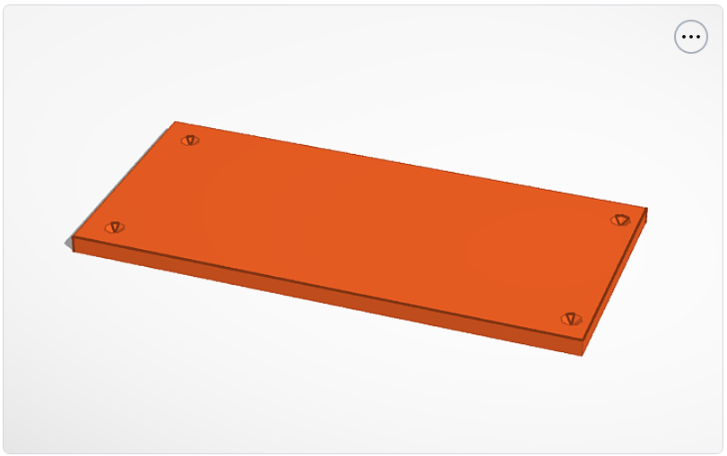
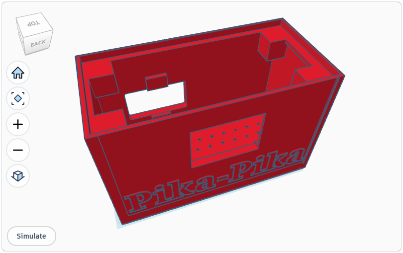

# 3D Printed Enclosure

To protect your Raspberry Pi and sensors, you can 3D print a custom enclosure designed specifically for Pika-pika.

-   **Top**
    { .glightbox data-title="Box Top" }

-   **Bottom**
    { .glightbox data-title="Box Bottom" }

## Design Files

The enclosure consists of two parts: the main box and a top cover. You can view and copy the designs on Tinkercad using the links below:

- **[Box Base](https://www.tinkercad.com/things/7Apo54P8HLZ-outer-box-pika-pika)**: The main body that houses the Raspberry Pi, ADS1115, and ZMPT101B.
- **[Box Top](https://www.tinkercad.com/things/287ad1ttfFJ-outer-top-pika-pika)**: The cover for the enclosure.

## Printing Recommendations

- **Material**: PLA or PETG.
- **Infill**: 15-20%.
- **Supports**: May be required depending on your printer's bridging capabilities.

## Assembly

1. Secure the Raspberry Pi into the base.
2. Route the voltage sensor wires through the designated ports.
3. Snap or screw the top cover into place (depending on the design iteration).
