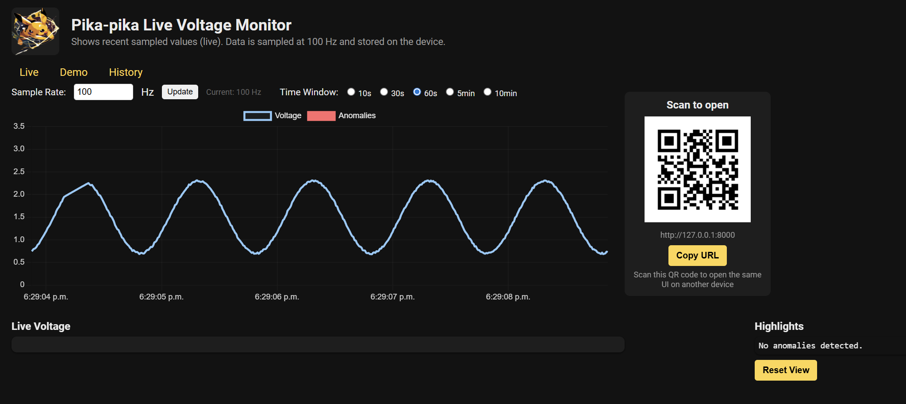
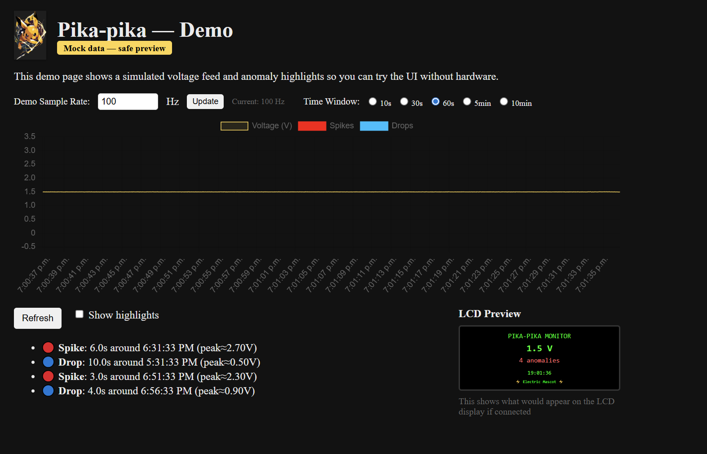
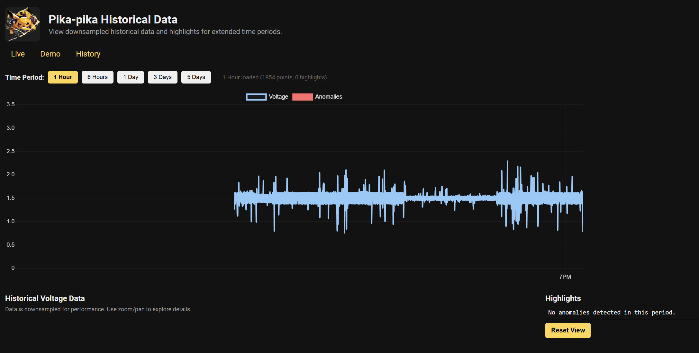

# Pika-pika Documentation

Welcome to the Pika-pika documentation. Pika-pika is a lightweight, Python-based voltage logger designed for the Raspberry Pi.

## Key Features

- **High-frequency Sampling**: Sample voltage at 100 Hz using the ADS1115.
- **Live Monitoring**: View real-time data and anomalies via a web interface.
- **Resource Efficient**: Designed to run smoothly on legacy hardware like the Raspberry Pi 2.
- **System Integration**: Includes systemd support with an automated watchdog for reliability.

## Getting Started

-   **[Raspberry Pi Setup](setup-pi.md)**
    Step-by-step guide for OS installation, project setup, and system integration.

-   **[Hardware & Wiring](wiring-steps.md)**
    Detailed parts list and wiring diagrams for the voltage sensor and ADC.

-   **[Mini-Display & QR](mini-display.md)**
    Setup and usage for the Waveshare 2" LCD status display.

-   **[Contributing Guide](contributing.md)**
    Information for developers wanting to improve the project.

### Quick Links

- [Live UI](/) (served by the running app)
- [Demo UI](/demo) (mock data — no hardware required)

## Screenshots

-   **Live Monitor**
    { .glightbox data-title="Live Voltage Monitor" }

-   **Demo Mode**
    { .glightbox data-title="Demo Mode" }

-   **History View**
    { .glightbox data-title="Historical Data Browser" }

